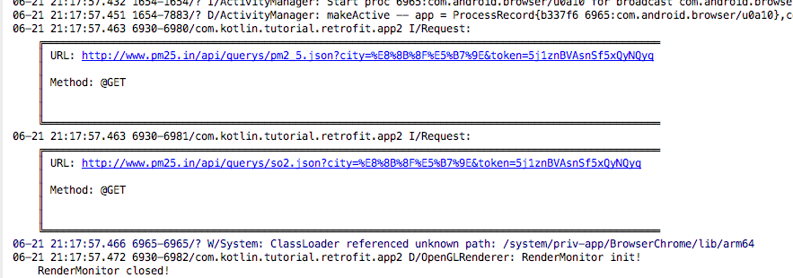
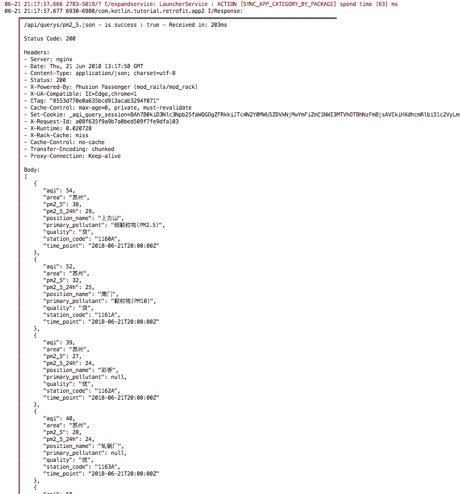
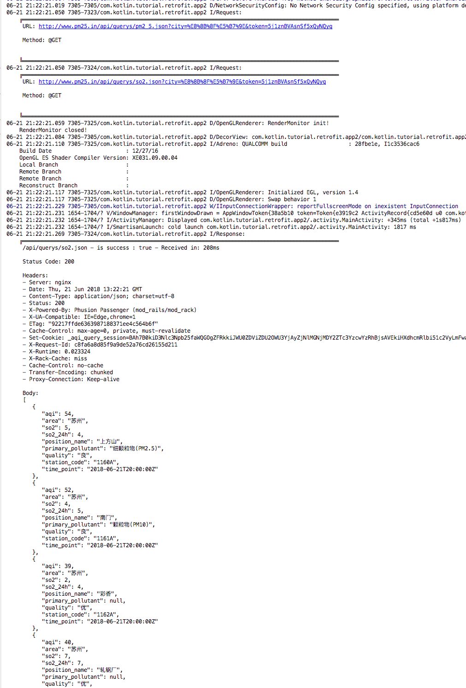

# saf-logginginterceptor

[](http://www.weibo.com/fengzhizi715)
[](https://www.apache.org/licenses/LICENSE-2.0.html)
[](https://jitpack.io/#fengzhizi715/saf-logginginterceptor)

# 一. 特性

* 支持http request、response的数据格式化的输出。
* 当请求为Post时，支持Form表单的打印。
* 支持超长日志的打印，解决了 Logcat 4K 字符截断的问题。
* 支持格式化时去掉竖线边框显示日志。方便将网络请求复制到Postman之类的工具，方便将请求结果复制给服务端的同学。
* 支持日志级别
* 支持显示当前的线程名称
* 支持排除一些接口的日志显示
* 底层使用 https://github.com/fengzhizi715/okhttp-logging-interceptor 作为统一的日志拦截器


 > 更完善的 Android 日志框架可以参考本人的另一个日志库 [L](https://github.com/fengzhizi715/SAF-Kotlin-log)  (https://github.com/fengzhizi715/SAF-Kotlin-log) 
 它提供丰富的日志功能，它的 saf-log-okhttp 模块提供类似于该库的功能。

# 二. 下载安装

将它添加到项目的 root build.gradle 中：

```groovy
	allprojects {
		repositories {
			...
			maven { url 'https://jitpack.io' }
		}
	}
```

Gradle:

```groovy
implementation 'com.github.fengzhizi715:saf-logginginterceptor:v1.6.2'
```  

# 三. 使用方法
它是用于记录OKHttp网络请求的日志的拦截器，纯 Kotlin 编写

## 3.1 在 Java 中使用

```java
            OkHttpClient.Builder builder = new OkHttpClient.Builder();
            builder.writeTimeout(30 * 1000, TimeUnit.MILLISECONDS);
            builder.readTimeout(20 * 1000, TimeUnit.MILLISECONDS);
            builder.connectTimeout(15 * 1000, TimeUnit.MILLISECONDS);

            LoggingInterceptor loggingInterceptor = AndroidLoggingInterceptor.build();

            //设置拦截器
            builder.addInterceptor(loggingInterceptor);
```

## 3.2 在 Kotlin 中使用

```kotlin    
        val builder = OkHttpClient.Builder()
        builder.writeTimeout((30 * 1000).toLong(), TimeUnit.MILLISECONDS)
        builder.readTimeout((20 * 1000).toLong(), TimeUnit.MILLISECONDS)
        builder.connectTimeout((15 * 1000).toLong(), TimeUnit.MILLISECONDS)

        val loggingInterceptor = AndroidLoggingInterceptor.build()

       //设置拦截器
       builder.addInterceptor(loggingInterceptor)
```

## 3.3 定制 LoggingInterceptor

可以参考 AndroidLoggingInterceptor 的 build() 以及 https://github.com/fengzhizi715/okhttp-logging-interceptor 进行定制 LoggingInterceptor

# 四. 效果显示

## 4.1 Get请求显示的效果：




## 4.2 返回Response的效果：




## 4.3 隐藏竖线边框，方便复制request、reqponse的内容：




联系方式
===

Wechat：fengzhizi715

> Java与Android技术栈：每周更新推送原创技术文章，欢迎扫描下方的公众号二维码并关注，期待与您的共同成长和进步。


License
-------

    Copyright (C) 2017 - present, Tony Shen.

    Licensed under the Apache License, Version 2.0 (the "License");
    you may not use this file except in compliance with the License.
    You may obtain a copy of the License at

       http://www.apache.org/licenses/LICENSE-2.0

    Unless required by applicable law or agreed to in writing, software
    distributed under the License is distributed on an "AS IS" BASIS,
    WITHOUT WARRANTIES OR CONDITIONS OF ANY KIND, either express or implied.
    See the License for the specific language governing permissions and
    limitations under the License.
